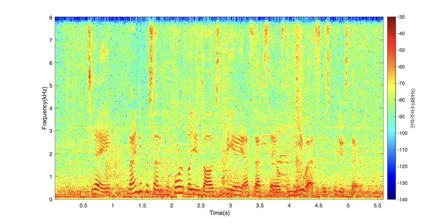
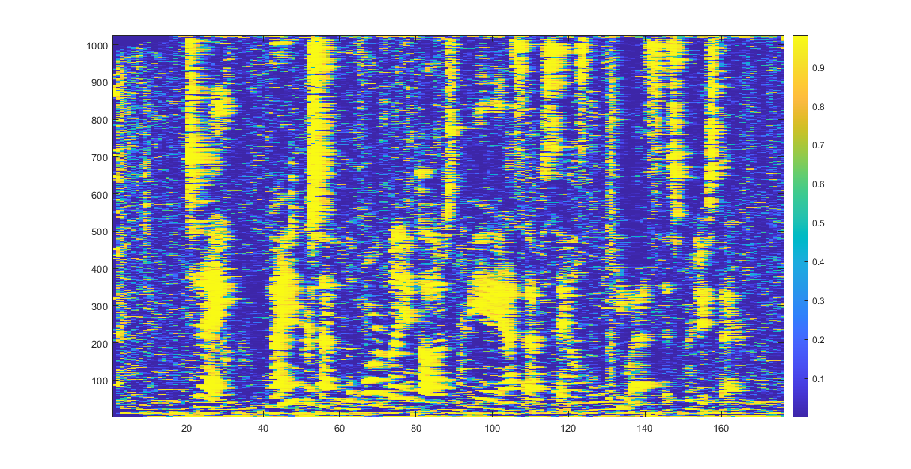
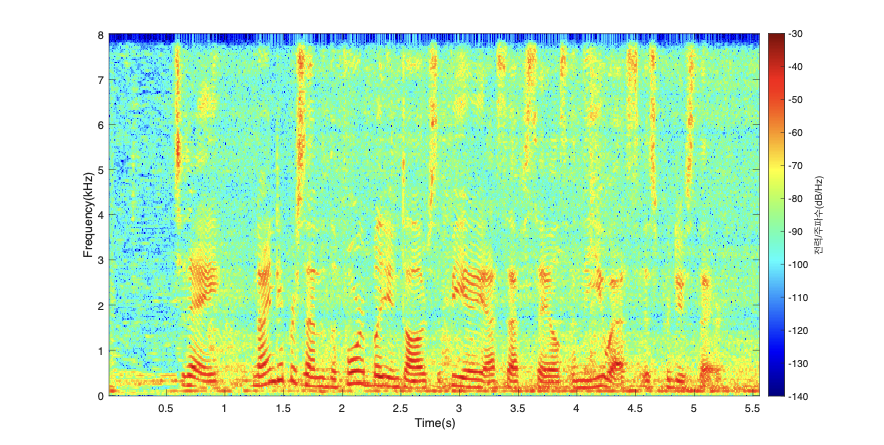
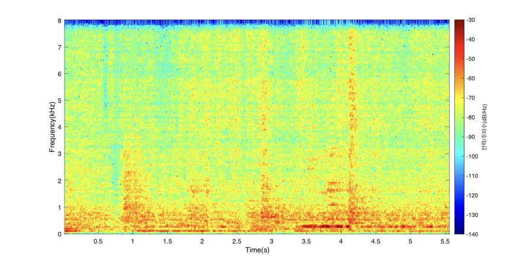

# API_AuxIVA_mask_Online

# Target Speech Extraction **API**

서강대 전자공학과 박형민 교수님 연구실에서 제작한 API이며, 타겟 화자가 배경 잡음 속에서 발화하는 다채널 음원 신호를 입력으로 해당 알고리즘이 예측하여 잡음이 억제된 타겟 화자 추출 결과를 반환 해주는 API입니다.

## **IVA(Independent Vector Analysis)**

여러 독립적인 신호가 뒤섞인 음원에 대해서 각 출력 채널이 최대한 독립적인 신호로 구성되도록 분리하는 알고리즘입니다. 이를 통해 노이즈와 타겟 음원을 서로 분리하여 타겟 음원을 추출할 수 있습니다.


## **CDR(Coherence-to-Diffuseness) mask**

target mask는 이떤 입력 신호가 주어졌을 때 time-frequency domain에서 target의 성분이 어느정도의 비율로 분포하는지를 나타내는 값을 말합니다. 따라서 모든 성분의 값은 0과 1사이에서 결정됩니다. 

CDR이란 완전히 방향성을 상실한 음원(Diffuseness)을 기준으로 방향성이 강한 정도 (Coherence)를 비율로 나타낸 값입니다. 이 값을 계산하려면 마이크 간의 거리를 필요로 합니다. 따라서 방향성을 가지는 target 음원이라면 이 값을 활용해서 mask를 효과적으로 예측할 수 있습니다.


## Setting Parameter in AUXIVA_mask_Online.h

```cpp
#define Nch			5
#define nWin		1024
#define BufferSize		256
#define SamplingFreq    16000
```

- `Nch` 은 설정하고자 하는 입력 마이크의 개수를 의미합니다.
- `nWin` 은 short time fourier transform(STFT) 에서 매 프레임 fast fourier transform(FFT)를 진행하기 위한 윈도우 샘플의 개수를 의미합니다. 이는 2의 거듭제곱 수로 설정하며 일반적으로 512~4096내에서 tuning을 진행할 수 있습니다.
- `BufferSize` 는 매 프레임 새로 들어오는 샘플의 개수를 말하며, 매 프레임은 전체 윈도우 샘플의 1/4간격으로 움직이기 때문에 nWin의 1/4값으로 설정 해줍니다.
- `SamplingFreq` 는 입력할 wav 파일의 샘플링 주파수로 설정 해줍니다.

## Microphone Configuration in ProcBuffers.cpp

```cpp
...
ProcBuffers::ProcBuffers()
{
...
	// mic_array[ch][0] = mic_array[0]과의 상대적인 x좌표입력
	// mic_array[ch][1] = mic_array[0]과의 상대적인 y좌표입력
	// mic_array[ch][2] = mic_array[0]과의 상대적인 z좌표입력
	mic_array[0][0] = 0;
	mic_array[0][1] = 0;
	mic_array[0][2] = -0.095;
	mic_array[1][0] = 0;
	mic_array[1][1] = 0;
	mic_array[1][2] = 0.095;
	mic_array[2][0] = 0;
	mic_array[2][1] = 0.10;
	mic_array[2][2] = 0.095;
	mic_array[3][0] = 0;
	mic_array[3][1] = -0.10;
	mic_array[3][2] = -0.095;
	mic_array[4][0] = 0;
	mic_array[4][1] = 0.10;
	mic_array[4][2] = -0.095;
...
```

마이크의 위치 배열을 설정합니다. 이는 각 마이크 간의 거리를 계산하기 위해서 필요한 것으로 어떤 것을 기준으로 잡고 설정해도 무관합니다.

## Build

x64로 빌드를 진행합니다.

## Execution

### **Target Speech Extraction API**

N개의 단일 채널 wav 입력 파일(**각 파일은 단일 채널**)을 입력 인수로 사용합니다. 출력 결과는 output 폴더 내부에 저장됩니다. **output 디렉토리가 없으면 오류가 발생합니다.**

### 실행 예시

빌드된 실행 파일의 이름을 API_BSS라고 가정할 때,

```bash
API_BSS input0.wav input1.wav input2.wav input3.wav input4.wav
```

샘플 입력과 출력은 각각 input과 output 디렉토리에 포함되어있습니다.

- **샘플 입력**

**input0.wav**
**input1.wav**
**input2.wav**
**input3.wav**
**input4.wav**

**1번 채널의 스펙트로그램**



**샘플 입력에 대한 평균 CDR mask**




- **샘플 출력**

**IVA_Target.wav**



**IVA_Noise_ch1.wav**


